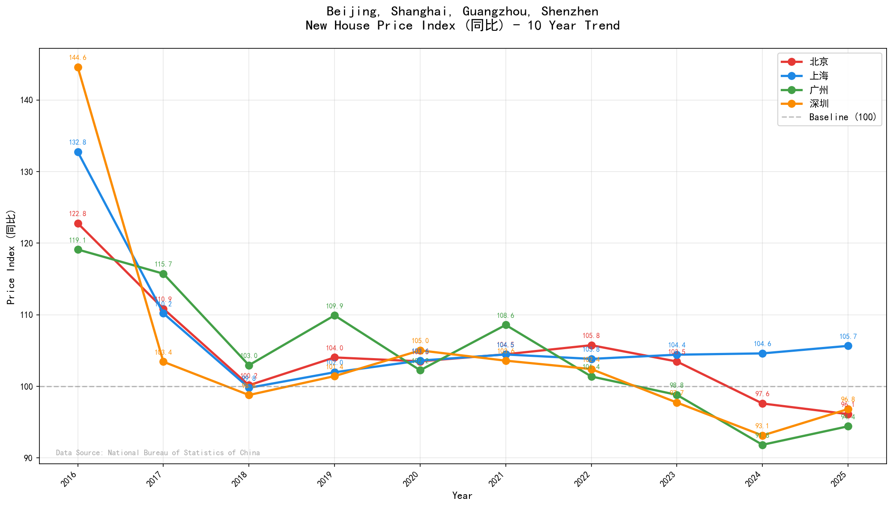

# 🏠 70城房价数据 | China 70-City House Price Index

[](./LICENSE)
[](https://www.python.org/)
[]()

**70城房价数据** 是一个用于抓取、提取和分析中国70个大中城市商品住宅销售价格变动的工具集。作为一个OpenCode Skill，它提供了完整的数据更新、查询、图表生成和一键分析功能。

## ✨ 功能特性

| 功能 | 描述 |
|-----|------|
| **自动更新** | 一键从国家统计局抓取最新房价数据（自动默认） |
| **灵活查询** | 按城市、时间范围、指数类型提取数据 |
| **可视化** | 生成趋势图、对比图等多种图表 |
| **年度汇总** | 生成年度趋势汇总图表 |
| **一键分析** | 快速生成完整的分析报告 |
| **自然语言** | 支持自然语言交互，如"帮我更新房价数据" |
| **多格式导出** | 支持CSV、Excel、JSON格式导出 |

## 📊 数据概览

- **数据来源**：中华人民共和国国家统计局
- **覆盖城市**：70个大中城市（35个省会/直辖市 + 35个其他城市）
- **时间跨度**：2006年至今（约4.5万条月度记录）
- **更新频率**：每月15-17日更新上月数据
- **指数类型**：环比、同比、定基比

## 🚀 快速开始

### 1. 安装

确保已安装Python 3.8+和必要的依赖：

```bash
pip install -r requirements.txt
```

### 2. 更新数据（自动默认）

```bash
# 自动搜索并更新最新数据（默认方式）
python scripts/update_price.py

# 或手动提供URL
python scripts/update_price.py "https://www.stats.gov.cn/sj/zxfbhjd/..."
```

### 3. 查询数据

```bash
# 按月份范围提取
python scripts/extract_price.py month 202401 202412

# 按城市提取
python scripts/extract_price.py city 北京 上海 广州 深圳

# 组合条件提取
python scripts/extract_price.py filter --cities 北京 --start 202001 --end 202412
```

### 4. 生成图表

```bash
# 生成城市房价趋势图
python scripts/generate_chart.py --cities 北京 上海 --start 202001 --end 202412

# 生成对比柱状图
python scripts/generate_chart.py --cities 广州 深圳 --type bar --output chart.png

# 生成年度趋势汇总图
python scripts/yearly_trend.py --cities 北京 上海 广州 深圳 --start 2016 --end 2025 --fixedbase 同比
```

### 5. 一键分析

```bash
# 快速分析多个城市
python scripts/quick_analysis.py --cities 北京 上海 广州 深圳 --start 202001 --end 202412
```

## 📈 示例效果

### 北上广深十年房价趋势（2016-2025）



**年度平均同比指数对比：**

| 年份 | 北京 | 上海 | 广州 | 深圳 |
|------|------|------|------|------|
| 2016 | 122.8 | 132.8 | 119.1 | 144.6 |
| 2017 | 110.9 | 110.2 | 115.7 | 103.4 |
| 2018 | 100.2 | 99.8 | 103.0 | 98.8 |
| 2019 | 104.0 | 102.0 | 109.9 | 101.4 |
| 2020 | 103.5 | 103.6 | 102.2 | 105.0 |
| 2021 | 104.5 | 104.5 | 108.6 | 103.6 |
| 2022 | 105.8 | 103.8 | 101.4 | 102.4 |
| 2023 | 103.5 | 104.4 | 98.8 | 97.7 |
| 2024 | 97.6 | 104.6 | 91.8 | 93.1 |
| 2025 | 96.1 | 105.7 | 94.4 | 96.8 |

生成命令：
```bash
python scripts/yearly_trend.py --cities 北京 上海 广州 深圳 --start 2016 --end 2025 --fixedbase 同比
```

## 📖 文档

| 文档 | 说明 |
|-----|------|
| [快速开始](docs/GETTING_STARTED.md) | 5分钟上手指南 |
| [用户手册](docs/USER_GUIDE.md) | 完整命令参考 |
| [示例集合](docs/EXAMPLES.md) | 20+实际使用示例 |
| [数据参考](docs/DATA_REFERENCE.md) | 数据结构说明 |
| [常见问题](docs/FAQ.md) | FAQ和故障排除 |

## 🏙️ 城市列表

### 35个直辖市及省会城市
北京、天津、石家庄、太原、呼和浩特、沈阳、大连、长春、哈尔滨、上海、南京、杭州、宁波、合肥、福州、厦门、南昌、济南、青岛、郑州、武汉、长沙、广州、深圳、南宁、海口、重庆、成都、贵阳、昆明、西安、兰州、西宁、银川、乌鲁木齐

### 35个其他城市
唐山、秦皇岛、包头、丹东、锦州、吉林、牡丹江、无锡、徐州、扬州、温州、金华、蚌埠、安庆、泉州、九江、赣州、烟台、济宁、洛阳、平顶山、宜昌、襄阳、岳阳、常德、韶关、湛江、惠州、桂林、北海、三亚、泸州、南充、遵义、大理

## 📂 项目结构

```
70city-price/
├── SKILL.md                    # OpenCode Skill主文档
├── README.md                   # 本文件
├── LICENSE                     # MIT许可证
├── requirements.txt           # Python依赖
├── .gitignore                  # Git忽略配置
├── docs/                       # 使用文档
│   ├── GETTING_STARTED.md
│   ├── USER_GUIDE.md
│   ├── EXAMPLES.md
│   ├── DATA_REFERENCE.md
│   └── FAQ.md
├── references/                 # 参考文档
│   ├── city_list.md
│   └── data_schema.md
├── scripts/                    # 工具脚本
│   ├── update_price.py        # 更新数据（自动默认）
│   ├── extract_price.py       # 提取数据
│   ├── generate_chart.py      # 生成图表
│   ├── yearly_trend.py        # 年度趋势汇总
│   └── quick_analysis.py      # 一键分析
├── assets/                     # 资源文件
│   └── chart_config.yaml
└── data/                       # 数据目录
    ├── 70cityprice.csv        # 主数据文件
    └── outputs/               # 生成文件（.gitignore）
```

## 🔧 命令列表

### `/update-70city-price`
从国家统计局网站更新房价数据（自动默认，无需参数）。

### `/select-city-price`
根据条件提取房价数据。

### `/gen-price-chart`
生成房价趋势图表。

### `/yearly-trend`
生成年度平均房价趋势汇总图表，适合多年对比分析。

### `/quick-select-price`
一键完成数据提取和图表生成。

详细用法请参考[用户手册](docs/USER_GUIDE.md)。

## 📝 数据结构

| 列名 | 说明 | 示例 |
|-----|------|------|
| DATE | 数据日期 | 2025/12/1 |
| ADCODE | 城市行政区划代码 | 110100 |
| CITY | 城市名称 | 北京 |
| FixedBase | 指数类型 | 同比/环比/定基比 |
| CommodityHouseIDX | 新建商品住宅指数 | 97.6 |
| SecondHandIDX | 二手住宅指数 | 91.5 |

完整字段说明请参考[数据参考](docs/DATA_REFERENCE.md)。

## ⚠️ 注意事项

1. **数据来源**：本项目数据来源于国家统计局公开数据
2. **更新频率**：国家统计局每月15-17日发布上月数据
3. **定基比说明**：定基比基期会定期轮换，跨期比较需注意
4. **网络要求**：更新数据需要访问国家统计局网站

## 📜 许可与声明

### 数据来源
本项目中的统计数据来源于**中华人民共和国国家统计局**，属于政府公开数据。

### 代码许可
本项目采用 [MIT License](./LICENSE) 开源。

### 免责声明
本项目仅提供数据整理与工具服务，不对数据准确性负责。如需官方数据，请访问[国家统计局网站](https://www.stats.gov.cn/)。

## 致谢

感谢[70城房价数据](https://github.com/hugohe3/70cityprice)项目给的灵感

## 🤝 贡献

欢迎提交Issue和Pull Request！

## 📧 联系方式

如有问题或建议，请通过GitHub Issues联系。

---

**数据来源**：国家统计局《70个大中城市商品住宅销售价格变动情况》
